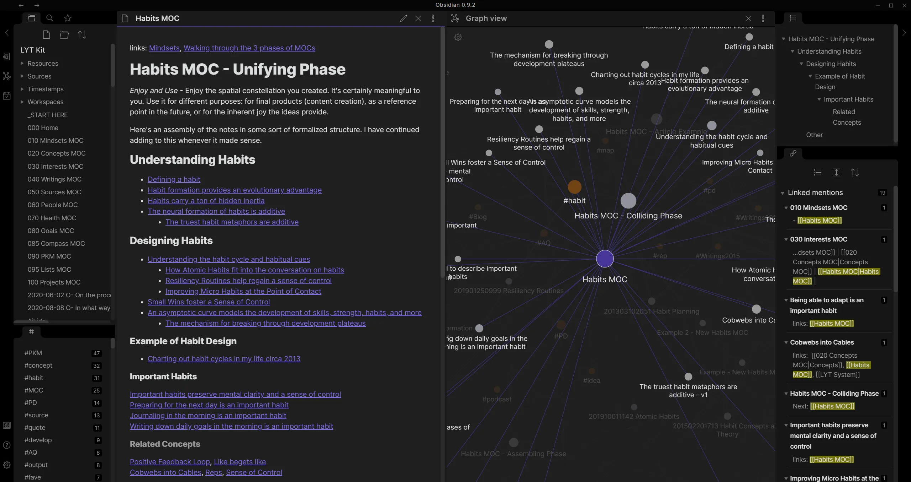

+++
title = "Building a Simple, Elegant, and Customizable Notetaking and Management System using Obsidian"

date = "2025-10-02"
aliases = [""]
name = "Building a Simple, Elegant, and Customizable Notetaking and Management System using Obsidian"
+++



# What is Obsidian

Obsidian is a powerful knowledge management tool that lets you create a fully customized, personal workspace. It’s perfect for students, professionals, and anyone who wants to organize their notes, tasks, and projects efficiently, all while keeping full control of your data.

---

## Why It’s Useful

- **Keeps information evergreen:** Notes stay relevant because linking them together forms a web of interconnected knowledge.
- **Incredibly customizable:** Every part of Obsidian can be tailored to fit your workflow.
- **Cross-platform:** Works seamlessly on both laptops and phones.
- **Plugin ecosystem:** Add powerful new features and automations through the community plugin system.

---

## Installing Obsidian

1. Go to the [Obsidian website](https://obsidian.md/).
2. Download the version for your operating system (Windows, macOS, or Linux).
3. Install the app using the standard installer for your platform.
4. On first launch, create a **Vault** (your main folder for notes). You can name it something like `Obsidian Desktop`.

You now have the base setup ready.

---

## Tailoring Obsidian to Your Use Case

This setup is designed to be **command palette based**, meaning most actions can be triggered by keyboard shortcuts or quick commands instead of menus. This keeps your workflow fast and efficient.

### Recommended Plugins

Below are the plugins that make this setup powerful and flexible. You can install these under **Settings → Community Plugins → Browse**.

- **Homepage:** Opens a specific page when you launch Obsidian.
- **Dataview:** Displays data from notes dynamically (great for project and task tracking).
- **Excalidraw:** Lets you create drawings, flowcharts, and whiteboard-style diagrams.
- **Omnisearch:** Improves the search function with fast, fuzzy results.
- **Templater:** Automates repetitive note creation with pre-made templates.
- **Tasks:** Adds powerful task management features with due dates and queries.
- **Quick Switcher++:** Enhances note switching with additional filtering and preview capabilities.

---

## Setting Up The Notebase

This project setup transforms Obsidian into a lightweight personal notebase with automatic task tracking and easy access to your most important notes.

### 1. Project Tracker with Dataview

You’ll use Dataview to display all tasks and notes in one central dashboard.

**Goal:**  
Whenever you create a task in any note (using the `- [ ]` syntax), it should automatically appear on your homepage in a table view.

**Example Dataview Query:**
```dataview
table file.link as "Note", status, priority, due
from "Projects"
where contains(file.folder, "Projects")
sort due asc
```

This shows all tasks within your “Projects” folder, sorted by due date. You can customize it to include tags, completion status, or file metadata.

---

### 2. Automatic Note Sorting by Tags

To keep your vault organized, add consistent tags like #project, #idea, or #reference. You can later use Dataview to sort and filter notes automatically.

Example:

```
table file.link as "Note", tags
where contains(tags, "project")
sort file.name asc
```

This ensures all notes tagged with “project” are easily viewable and grouped.

---

### 3. Ephemeral Notes

Create a folder named Ephemeral for short-lived notes such as daily logs, reminders, or ideas. You can feature these notes on your homepage using a Dataview query like:

```
table file.link as "Recent Notes", file.mtime as "Last Edited"
from "Ephemeral"
sort file.mtime desc
limit 5
```

This keeps your most recent or temporary notes easily accessible on your dashboard.

---

### Backing Up Your Notes With Clound Sync

One of the best parts of Obsidian is that your notes are stored as plain Markdown files on your computer. You can easily back them up using:

Use Obsidian Sync (paid) or third-party tools like Dropbox, Google Drive, or Syncthing.

Simply point your sync folder to your vault to keep everything automatically backed up.

##### Example: Setting Up Free Sync With Google Drive

Google Drive (Example)
1. Install Google Drive for Desktop from https://www.google.com/drive/download.

2. Once installed and configured, a Google Drive folder will appear on your computer.

3. Move your Obsidian vault folder into that Google Drive folder. For example: Google Drive/Obsidian/Student Notebase/

4. Google Drive will automatically upload and sync your notes.

5. On your phone, install both Google Drive and Obsidian from the app store.

6. Open the Obsidian app, and choose “Open Folder as Vault.” Navigate to the same folder inside Google Drive on your phone.

7. Now your notes are backed up and stay the same on both devices. You can do the same with Dropbox or OneDrive if you prefer those.

### Summary

This setup gives you a powerful, self-contained workspace that:

Tracks all your projects and tasks automatically.

Keeps your notes organized and interconnected.

Adapts to your workflow through plugins.

Works across devices with cloud or Git syncing.

Whether you’re using it for school, personal projects, or creative writing, Obsidian can become the digital brain that ties everything together.
