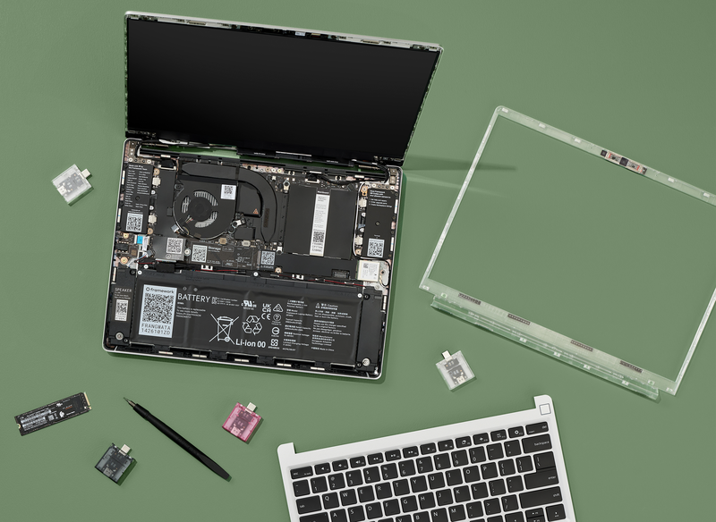

+++
title = "Building a Custom Ortholinear Keyboard with a 'TrackPoint' for the Framework Laptop 13"

date = "2025-09-15"
aliases = [""]
name = "Building a Custom Ortholinear Keyboard with a 'TrackPoint' for the Framework Laptop 13"
+++

I have a problem: I’m very particular about how my keyboards feel.

Since I travel a lot, I use laptops more than desktops, which means I’m often stuck with laptop keyboards. After trying plenty of machines, I landed on ThinkPads. Their keyboards and TrackPoints make it so much easier to move around my workspace while keeping my hands in place on the home row.

Now I can’t go back to a keyboard without a TrackPoint. The issue is that I want features that no modern ThinkPad will give me.

That’s where the Framework 13 comes in. It’s modular, durable, repairable, and designed with openness in mind, which makes it the perfect base for tinkering.

All that’s left is the keyboard. Easy enough, right?

And that’s how this project started: redesigning the Framework’s baseplate to fit a custom ortholinear keyboard with deeper keys if I can manage it.

# Ongoing Project Log  

I’m designing and building a custom ortholinear keyboard with a "TrackPoint" for the Framework Laptop 13. This will require replacing the entire input cover, including the stock keyboard and trackpad, with a fully custom design.  

The goal is to document each step so others can follow along, learn, and maybe even build their own.

---

## 🔍 Project Goals
- Replace Framework’s default input cover with a custom ortholinear keyboard.  
- Integrate a TrackPoint pointing stick between the central columns.  
- Keep the design within the thin height limits of the Framework 13.  
- Use a dedicated microcontroller (MCU) to handle the keyboard matrix + TrackPoint → expose as USB HID, no EC firmware hacks.  
- Make the mod reversible, keeping in spirit of the modularity of the framework laptop by keeping the stock input cover intact.  

---

## 📂 References & Resources
- Framework CAD files: [Framework GitHub](https://github.com/FrameworkComputer)  
- Input cover & spares: [Framework Marketplace](https://frame.work/marketplace)  

---

## 🛠 Hardware Planning
### Switches + Keycaps
TBD.

### TrackPoint
TBD.

### Controller (MCU)
TBD.

### Fabrication
TBD.

### Software
- OpenSCAD

---

## ⚙️ Firmware
- Using QMK for wired connection and TrackPoint PS/2 support.  
- Plan: configure matrix + TrackPoint as a USB HID device → plugs into Framework mainboard.  
- Alternative: reuse Framework keyboard connector (advanced, higher risk).  

---

## 🖊 Mechanical Design Plan
1. CAD work: extract input cover dimensions from Framework GitHub files.  
2. Keyboard plate: design ortholinear grid in CAD → ~1.0–1.5 mm FR4 or aluminum.  
3. Clearance checks:  
   - Top: keycaps vs display bezel.  
   - Bottom: switch + PCB stack within ~6 mm depth.  
4. TrackPoint placement:  
   - Between middle columns (like G/H/B).  
   - Reinforce plate cutout.  
5. Mouse buttons:  
   - Option A: 3 physical buttons under spacebar.  
   - Option B: combos mapped in firmware (less tactile).  

---

## 🔌 Electrical Design Plan
- Matrix: diodes on every switch → wired into MCU GPIO.  
- TrackPoint: PS/2 wiring → MCU pins with pull-ups.  
- Connection:  
  - Option A: USB HID device internally wired to a spare USB port.  
  - Option B: pinout hack to Framework EC (risky).  

---

## 🧪 Prototyping Workflow
1. 3D print early plate mockups with Choc cutouts.  
2. Hand-wire a test matrix + TrackPoint to RP2040.  
3. Flash QMK with VIA support → confirm function.  
4. Test ergonomics → confirm TrackPoint placement.  
5. Once stable:  
   - Full PCB design in KiCad/Eagle.  
   - Order first PCBs (JLCPCB/PCBWay).  
6. Assemble test build in spare input cover.  

---

## ⚠️ Risks / Challenges
- Height constraints → only Choc/low-profile switches work.  
- TrackPoint sourcing → need to secure hardware early.  
- Keycap availability → ortholinear Choc sets are niche.  
- Firmware complexity → avoid messing with Framework EC, stick to USB HID.  
- Prototyping cycle → expect multiple iterations before final fit.  

---

## 📈 Next Steps
- Download CAD files and measure input cover cavity depth.  
- Finalize ortholinear layout (40% vs 60%).  
- Order switches, keycaps, TrackPoint now (long lead times).  
- Prototype a hand-wired test keyboard.  
- Start documenting PCB design once prototype works.  

---

## 🗓 Project Updates (log)
’ll use this section as a changelog for progress updates:  

To be updated...

---

### 💬 Stay Tuned
This is a living project log. As I make progress, I’ll update this page with photos, CAD exports, firmware configs, and lessons learned.  

---
